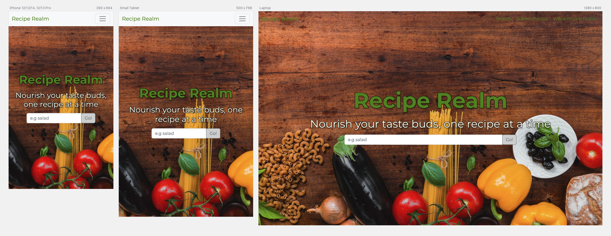
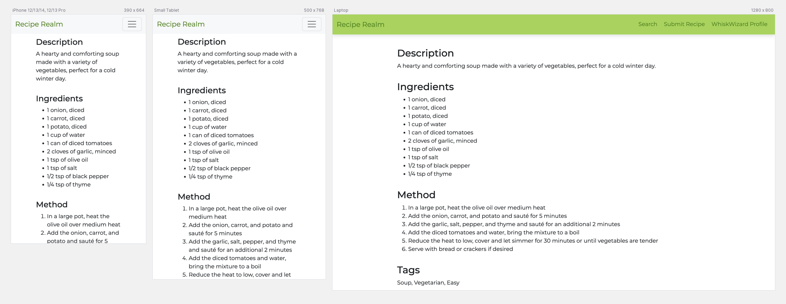
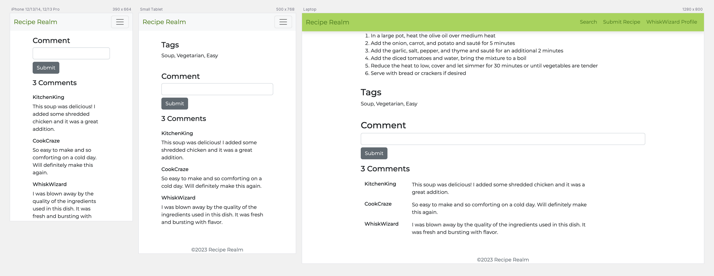
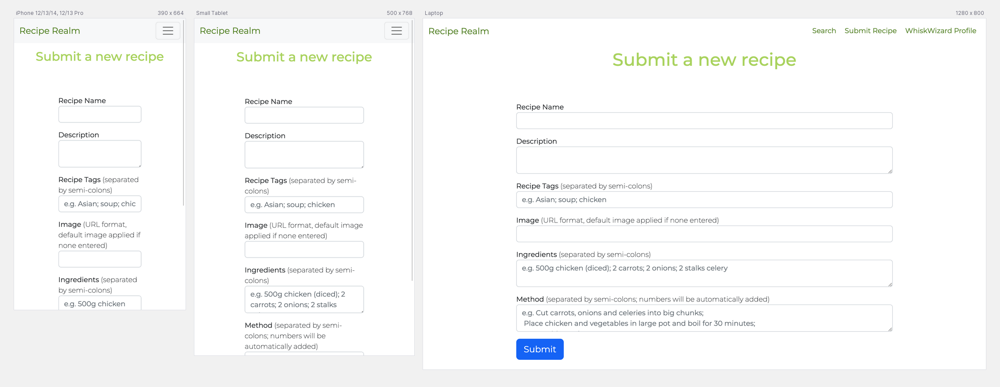
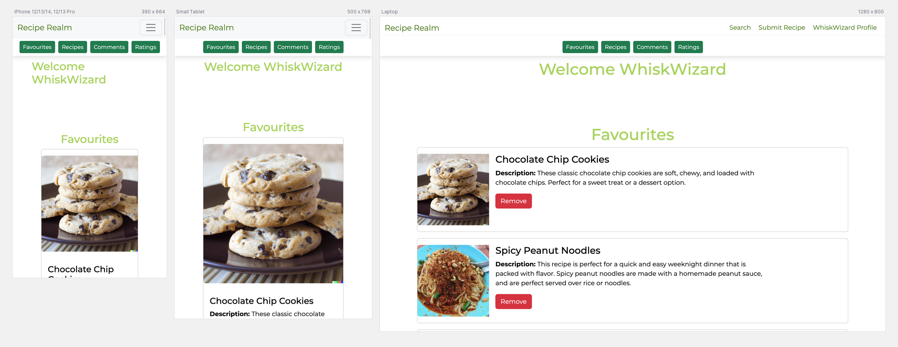
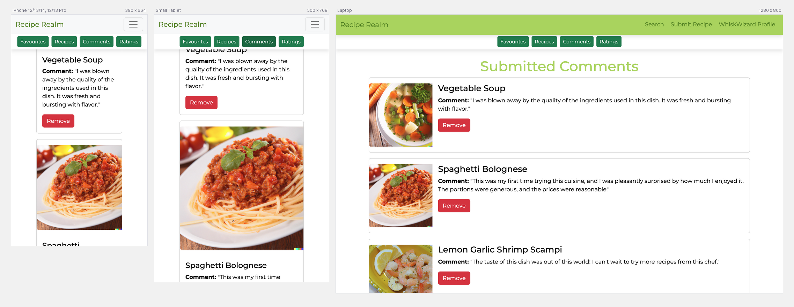
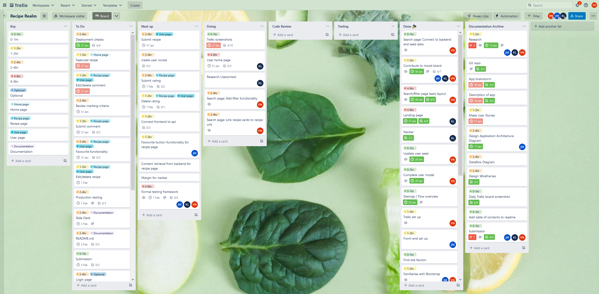
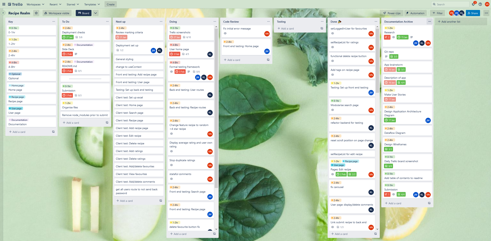
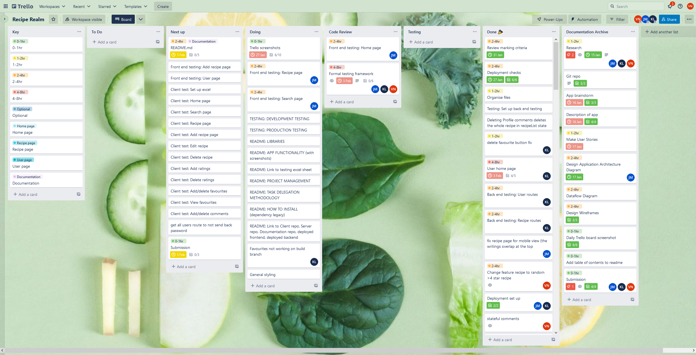

# T3A2-B - Recipe Realm
## Table of Contents

- [Table of Contents](#table-of-contents)
- [Deployed website](#deployed-website)
- [GitHub repository](#github-repository)
- [Full Stack App - Part A README](#full-stack-app---part-a-readme)
- [App Screenshots](#app-screenshots)
- [Trello Screenshots](#trello-screenshots)

---
## Team
Kenny Lai, John Masters, Vicky Nie
## Deployed website

- [🔗 Client deployed with Vercel](https://recipe-realm.vercel.app/)

## GitHub repository

- [🔗 Repository](https://github.com/Recipe-devs/)


## Full Stack App - Part A README

- [🔗 README.md for T3A2-A](https://github.com/Recipe-devs/T3A2-A#readme)

## Installation Instructions

To install the application, follow the instructions below:  

### Requirements  

- [Node.js](https://nodejs.org/en/)  
- [Mongodb atlas account](https://www.mongodb.com/atlas)  
  
### Server

- Create a new directory on your local machine where you would like to store the application  
- `CD` into the directory created  
- Open terminal and run the following command:  
```git clone https://github.com/kenny791/recipe-realm-app.git```  
- Change directory into the server directory  
- Install the required dependencies by running the following command:  
```npm install```  
- Create a .env file in the root directory of the server and add the following:  
```MONGODB_URI=<your mongodb uri>```  
- Seed the database by running the following command:  
```node seed.js```  
- Run the following command to start the server:  
```nodemon```  

### Client

- Create a new directory on your local machine where you would like to store the application
- `CD` into the directory created
- Open terminal and run the following command:
```git clone https://github.com/kenny791/recipe-realm-app.git```
- Change directory into the client directory
- Install the required dependencies by running the following command:
```npm i --legacy-peer-deps```
- Run the following command to start the client:
```npm run start```

## API Endpoints

| Recipes             | Users          | Favourites                | Ratings                  | Comments                               |
| ------------------- | -------------- | ------------------------- |--------------------------|----------------------------------------|
| Get /recipes        | Get /users     | Post users/:id/favourites | Post /recipes/:id/rating |  Patch /recipes/edit/:id               |
| Get /recipes/:id    | Get /users/:id | Patch /users/:id          | Patch /recipes/edit/:id  | Delete recipes/:id/comments/:commentId |
| Post /recipes       |                |                           |                          |                                        |
| Patch /recipes/:id  |                |                           |                          |                                        |
| Delete /recipes/:id |                |                           |                          |                                        |

---

## Testing
For the Development user testing and Production user testing please refer to the link google sheets.  [🔗 Testing Log](https://docs.google.com/spreadsheets/d/1Frl0Zy8GrOcx9Is8IIautDvwdgYqtHtHU5fn7SwIDXE/edit?usp=sharing)
### Server

- *Database to be reseeded before and after testing to ensure data integrity.  
Testing was performed using Jest and Supertest. Please see files for results
- Development and Production testing was performed on the server via [🔗 Postman API testing](https://documenter.getpostman.com/view/25499214/2s8ZDcxKJF#f8afa11a-8578-42d2-8702-39876e69dfca)  
  Testing was also performed using JESt and Supertest. Please use the following commands to run the tests.
- To run the standard tests, you can run `npm run test`
- To check the coverage of the tests, you can run `npm run test-cc`

### Client
- Testing can be run by run with a few commands from the root directory of the Client folder.
- To run the standard tests, you can run `npm run test`
- To check the coverage of the tests, you can run `npm run coverage`
- To run the tests in the web based GUI, you can run `npm run test:ui`

## Libraries & Dependencies

### Server

- express: is an open source web application framework for Node.js. It is used to create the server and handle the routing of the application.
- mongoose: is the object data modelling library used to connect the application to the mongodb database. It is used to allow the application to interact with the database.
- dotnev: is a library that allows the use of environment variables. This was used to pass in the mongodb creditentials from the .env file to the application.  
- cors: a Node.js package that allows for cross-origin resource sharing between the Express server and the React client through middleware.
- nodemon: is a library that monitors the code and restarts the server when changes are made.
- jest: a JavaScript testing framework used to test the application.
- supertest: a Node.js library that allows for testing of HTTP endpoints.

### Client

- react: This is the main react library. It provides tools for building user interfaces based on UI components.
- react-dom: This is a package that provides methods that can used to interact with webpages through the DOM.
- react-router-dom: This library enables implementation of dynamic routing in a React application.
- react-router-hash-link: This allows smooth scrolling to anchor tags.
- @testing-library/jest-dom: A library that provides a custom set of jest matchers to test the state of the DOM.
- @testing-library/react: A lightweight library for testing React components. It provides a complete testing library for DOM testing in React.
- @testing-library/react-hooks: A library that enables easy testing of React hooks.
- @testing-library/user-event: A library that allows you to simulate real user events that happen in the browser, like clicks.
- @types/react: Provides type definitions for React.
- @types/react-dom: Provides type definitions for React DOM.
- @vitejs/plugin-react: A Vite plugin for React, and provides various utilities for React.
- @vitest/coverage-c8: A Vite test library, which provides test coverage reports.
- @vitest/ui: A Vite test library, which provides a user interface for running tests.
- jsdom: A library for creating a virtual DOM in Node.js, which is used for testing React components.
- vite: A frontend build tool that provides a fast and efficient development experience.
- vitest: A testing library designed for Vite built apps and components.

## App Screenshots

### Landing Page




### Search Page


### Search Page With Filters

  

### Recipe Details Page



  

### Submit Recipe Page

  

### User Profile Page


  

## Task Delegation  
Tasks were delegated to each team member based on their strengths and interests. Team members were also encouraged to select tasks from the trello To do list that they we interested in learning more about, for example testing, deployment, route creation. If there was a tasks that a team member was not confident in completing, they were encouraged to ask for help from the other team members during the daily stand up, where they could discuss the task and how to complete it.  
<br>
This project was to be a learning experience for all team members, and as such, the team members were rotated through the main roles, of project leader, front-end lead developer, back-end lead developer, and tester. This allowed for each team member to gain experience in each role, and to learn from the other team members.


## Project management

For this project we have decided to use the Agile methodology for project management. This will see the quick completion of tasks, daily stand ups of what tasks have been completed and will be completed in the next 24 hours, and flexibility to changes to the requirements of the project.


This will be managed is Trello, a Kanban style project management tool, where individual tasks are noted on separate cards. Each card will have properties to determine which member of the group it is assigned to, when it is due, and the estimated time to complete the task. Within the cards there are also sub-lists, to further breakdown the tasks and allow for incremental progress to be seen.  

## Trello Screenshots
<details>
  <summary>Click to expand</summary>
  
### January 23


### January 24


### January 25


### January 26


### January 30


### January 31


### February 1


### February 2


### February 3


### February 5


</details>